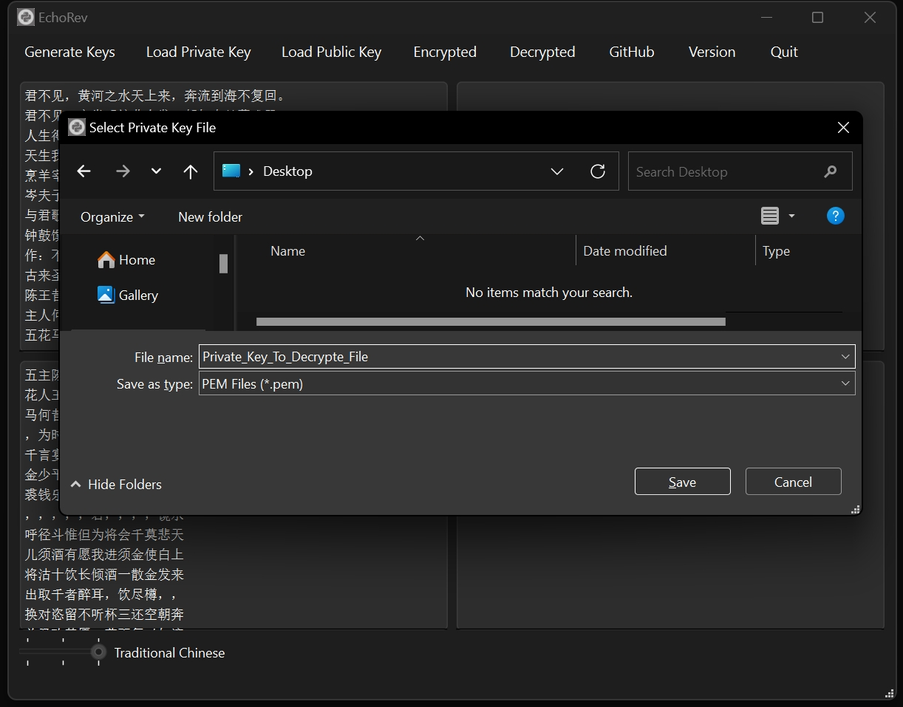
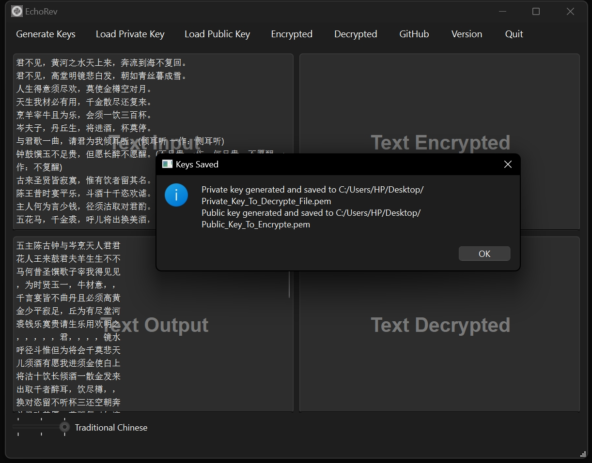
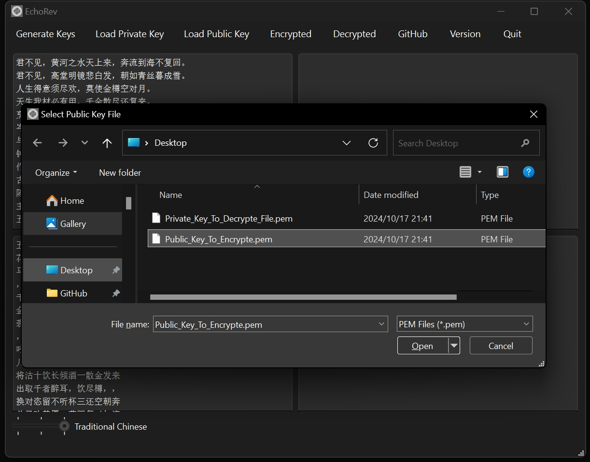
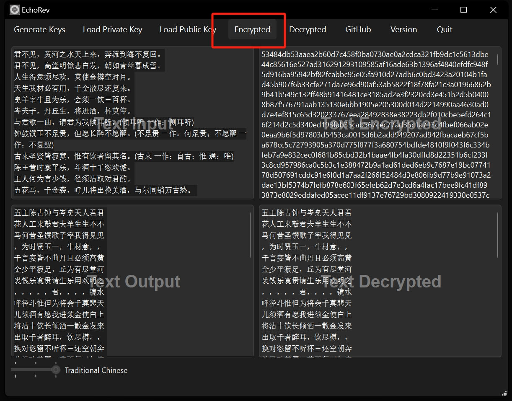

# EchoRev: A Linguistic Tool for Customizing Text Direction and Encryption

EchoRev is a unsophisticated GUI tool designed to assist in reversing text direction and encrypting/decrypting text. This tool is particularly useful for linguists and language enthusiasts who deal with the complexities of different writing systems. Some languages are written from right to left, while others are written from left to right. EchoRev addresses this challenge by providing a flexible solution for converting text direction, hoping it to be a simple tool for related research and language processing.

Earlier versions have only functions in reversing text direction, but the current version has been updated to provide encryption and decryption functions.

## Installation

The earlier version of this tool was developed using PyQt5, but the current version has been updated to use PySide6, a Qt binding for Python that is more compatible with modern operating systems.

```Bash
pip install requests
pip install pyside6
pip install cryptography
pip install echorev 
```

OR adding `--user` to avoid the `EnvironmentError`

```Bash
pip install requests --user  
pip install pyside6 --user  
pip install cryptography --user  
pip install echorev --user  
```

Then run the following command to start the GUI:

```Bash
python -c "import echorev;echorev.main()"
```


## Usage

The GUI has four main functions: reversing text direction, generating public and private keys for encryption and decryption, encrypting text, and decrypting text.
As shown in the following Figure 1, the GUI is divided into four tabs: "Text Input", "Text Output", "Text Encrypted ", and "Text Decrypted". 


#### Figure 1


### Text Conversion

Enter the original text in the Text Input section at the top left corner, and then the converted text in the corresponding order will be presented in the Text Output interface at the bottom left corner.

This software supports three conversion methods by default.
The first one, as shown in Figure 2, is to convert left-to-right text to right-to-left.


#### Figure 2

The second one, as shown in Figure 3, converts horizontal text from left to right to vertical text, the vertical direction is from left to right.


#### Figure 3

The third, as shown in Figure 4, conforms to the text direction of traditional Chinese Old Chinese, where the original text is horizontal rows of text from left to right, and is converted into vertical text, the vertical direction is from right to left.


#### Figure 4

### Generate Keys

The new version of this software adds text encryption and decryption function.

First of all, the basic function is to generate the private key and public key of RSA, which is an asymmetric encryption algorithm, after generating it, you can decrypt it at any time by keeping your own private key, and the public key can be sent to the other party so that the other party can encrypt the cipher text and send it to themselves.
Be sure to note that the public key should be sent to the other party, the private key to keep their own, so that the other party encrypted text with the public key, they can use their own private key to view.

If you want to send the encrypted text to the other party, you need the other party's public key to encrypt it.


#### Figure 5


As shown in Figure 5 is to generate the private key, Figure 6 shows is to generate the public key.


#### Figure 6

There will be a corresponding prompt after successful key generation.


#### Figure 7

### Load Keys

In addition to generating keys, you naturally need to be able to load already existing keys, making sure to take care to load the other party's public key for encryption and your own private key for decryption. As shown in Figure 8 and 9.


#### Figure 8


#### Figure 9

### Encryption and Decryption

After ensuring that the public key for encryption and the private key for decryption are loaded correctly, you can click the corresponding button to encrypt and decrypt the text, as shown in Figure 10 and 11.


#### Figure 10


#### Figure 11